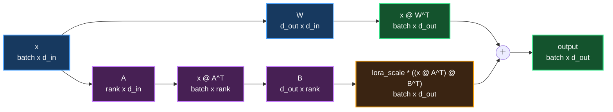

# LoRA Linear

难度：Medium

## 题目描述

实现 LoRA（Low-Rank Adaptation）线性层的前向传播。

给定：

- 输入矩阵 `x`，形状为 `batch x d_in`
- 基础权重矩阵 `W`，形状为 `d_out x d_in`
- LoRA down-projection 矩阵 `A`，形状为 `rank x d_in`
- LoRA up-projection 矩阵 `B`，形状为 `d_out x rank`

需要计算：

$$
output = x W^T + lora\_scale \cdot (x A^T) B^T
$$

所有张量类型均为 `float32`。

## 计算流程

## 实现要求

- 实现 `solve` 函数，不要修改函数签名。
- 不要使用题目提供范围之外的外部库。
- 将结果写入 `output`。

## 示例

### Example 1

$$
x =
\begin{bmatrix}
1 & 0 & -1 & 2 \\
0 & 1 & 1 & -1
\end{bmatrix},
\quad
W =
\begin{bmatrix}
1 & 0 & 0 & 0 \\
0 & 1 & 0 & 0 \\
0 & 0 & 1 & 0
\end{bmatrix}
$$

$$
A =
\begin{bmatrix}
1 & 0 & 0 & 0 \\
0 & 1 & 0 & 0
\end{bmatrix},
\quad
B =
\begin{bmatrix}
1 & 0 \\
0 & 1 \\
0 & 0
\end{bmatrix}
$$

当 `lora_scale = 0.5` 时：

$$
output = xW^T + 0.5 \cdot (xA^T)B^T
$$

$$
=
\begin{bmatrix}
1 & 0 & -1 \\
0 & 1 & 1
\end{bmatrix}
+
0.5 \cdot
\begin{bmatrix}
1 & 0 \\
0 & 1
\end{bmatrix}
\begin{bmatrix}
1 & 0 & 0 \\
0 & 1 & 0
\end{bmatrix}
=
\begin{bmatrix}
1.5 & 0 & -1 \\
0 & 1.5 & 1
\end{bmatrix}
$$

## 约束

- `1 <= batch <= 1,024`
- `1 <= d_in, d_out <= 8,192`
- `1 <= rank <= 256`
- `rank < min(d_in, d_out)`
- 所有张量均为 GPU 上的 `float32`
- 性能测量参数：`batch = 256`, `d_in = 4,096`, `d_out = 4,096`, `rank = 64`
